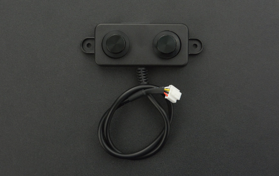

# DFRobot_RaspberryPi_A02YYUW 

* [English Version](./README.md)

这是一款测距传感器， 用户可以通过串行接口和树莓派通信，它具有以下特点：<br>
1. 测距范围：0~4500mm。
2. 串口通信参数配置：9600波特率，8位数据位，1位停止位，无校验位。




## 产品链接（[https://www.dfrobot.com.cn/goods-2044.html](https://www.dfrobot.com.cn/goods-2044.html)）
    SKU: SEN0311

## 目录

  * [概述](#概述)
  * [库安装](#库安装)
  * [方法](#方法)
  * [兼容性](#兼容性)
  * [历史](#历史)
  * [创作者](#创作者)

## 概述

这是一个基于Python语言的传感器测距库，它具有以下功能：<br>
1. 设置测距范围：0~4500mm。
2. 获取测距距离。

## 库安装

1. 下载库至树莓派，要使用这个库，首先要将库下载到Raspberry Pi，命令下载方法如下:<br>
```python
sudo git clone https://github.com/DFRobot/DFRobot_RaspberryPi_A02YYUW
```
2. 打开并运行例程，要执行一个例程demo_x.py，请在命令行中输入python demo_x.py。例如，要执行demo_get_distance.py 例程，你需要输入:<br>

```python
python demo_get_distance.py 
或 
python2 demo_get_distance.py 
或 
python3 demo_get_distance.py 
```

## 方法

```python
  '''!
    @brief    设置测距范围
    @param min: 最小测距距离(0~4500) 
    @param max: 最大测距距离(0~4500)
    @note 条件：min < max
  '''
  def set_dis_range(self, min, max):
    
  '''!
    @brief  获取测距距离
    @return  测距距离
  '''
  def getDistance(self):
```

## 兼容性

| 主板         | 通过 | 未通过 | 未测试 | 备注 |
| ------------ | :--: | :----: | :----: | :--: |
| RaspberryPi2 |      |        |   √    |      |
| RaspberryPi3 |      |        |   √    |      |
| RaspberryPi4 |  √   |        |        |      |

* Python 版本

| Python  | 通过 | 未通过 | 未测试 | 备注 |
| ------- | :--: | :----: | :----: | ---- |
| Python2 |  √   |        |        |      |
| Python3 |  √   |        |        |      |

## 历史

- 2019/08/31 - 1.0.0 版本

## 创作者

Written by Arya(xue.peng@dfrobot.com), 2021. (Welcome to our [website](https://www.dfrobot.com/))


