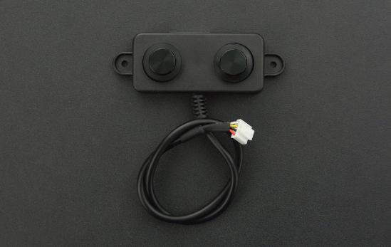

# DFRobot_RaspberryPi_A02YYUW 

* [中文](./README_CN.md)

This is a ranging sensor, which is communicates with raspberry pi via UART interafce. Its main feature: <br> 
1. Ranging range: 0~4500mm.
2. Serial port configuration: 9600 baudrate, 8 data bits, 1 stop bit, no parity bit.



## Product Link（[https://www.dfrobot.com/product-1935.html](https://www.dfrobot.com/product-1935.html)）
    SKU: SEN0311

## Table of Contents

* [Summary](#summary)
* [Installation](#installation)
* [Methods](#methods)
* [Compatibility](#compatibility)
* [History](#history)
* [Credits](#credits)

## Summary

This is a Ranging sensor library based on python, its features:
 
1. Set the range of ranging：0~4500mm. 
2. Get ranging distance. 

## Installation
1. To use this library, first download the library file<br>
```python
sudo git clone https://github.com/DFRobot/DFRobot_RaspberryPi_A02YYUW
```
2. Open and run the routine. To execute a routine demo_x.py, enter python demo_x.py in the command line. For example, to execute the demo_get_distance.py routine, you need to enter :<br>

```python
python demo_get_distance.py 
or
python2 demo_get_distance.py
or
python3 demo_get_distance.py
```

## Methods

```python
  '''
    @brief    set distance range.
    @param min: Minimum ranging distance
    @param max: Maximum ranging distance
    @note condition: min < max
  '''
  def set_dis_range(self, min, max):
      
  '''
    @brief    Get measured distance
    @return    measured distance
  '''
  def getDistance(self):

```
## Compatibility

| Board        | Pass | Failed | Not tested | Remarks |
| ------------ | :--: | :----: | :--------: | :-----: |
| RaspberryPi2 |      |        |     √      |         |
| RaspberryPi3 |      |        |     √      |         |
| RaspberryPi4 |  √   |        |            |         |

* Python Version

| Python  | Pass | Failed | Not tested | Remarks |
| ------- | :--: | :----: | :--------: | ------- |
| Python2 |  √   |        |            |         |
| Python3 |  √   |        |            |         |

## History

- 2019/08/31 - Version 1.0.0 released.

## Credits

Written by Arya(xue.peng@dfrobot.com), 2021. (Welcome to our [website](https://www.dfrobot.com/))
